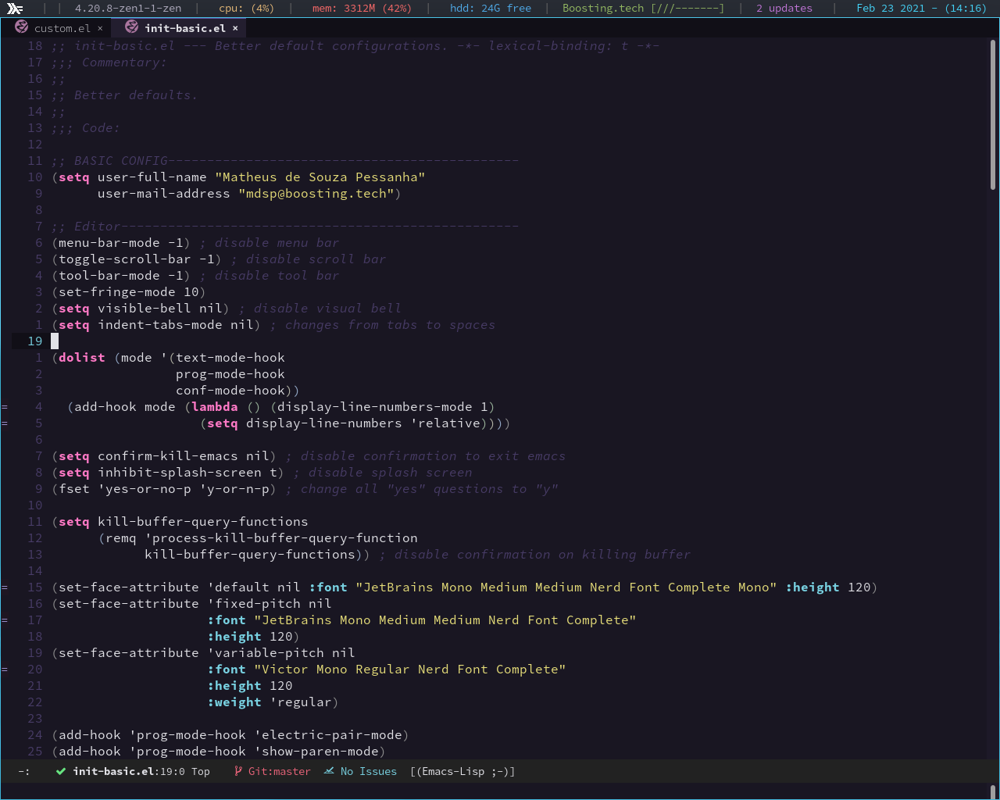

<h1 align="center">
   
  
   
  Omni for <a href="https://www.gnu.org/software/emacs/">Emacs</a>
   
</h1>

  <strong>Dark theme for <a href="https://www.gnu.org/software/emacs/">Emacs</a></strong>

  

  

  <a href="#install">Install</a> •
  <a href="#team">Team</a> •
  <a href="#license">License</a>

  

## Install

All instructions can be found at [INSTALL.md](./INSTALL.md).

## Supported packages

Omni has supports for many packages, including the following:

- ace-window
- anzu
- avy
- centaur-tabs
- clojure-mode
- company-mode
- diff-hl
- ediff
- elfeed
- erc
- eshell
- flycheck
- helm
- hydra
- ido
- ivy
- jabber.el
- js2-mode
- ledger
- linum
- magit
- markup-face
- notmuch
- orgmode
- powerline
- show-paren
- visible-mark
- web-mode
- wgrep
- whitespace-mode

## Team

This theme is maintained by the following person(s) and a bunch of [awesome contributors](https://github.com/getomni/template/graphs/contributors).

|      |
| ------------------------------------------------------------------------------------------------ |
| [Zoey Pessanha](https://github.com/zoedsoupe)                                                  |

## License

[MIT License](./LICENSE.md)
